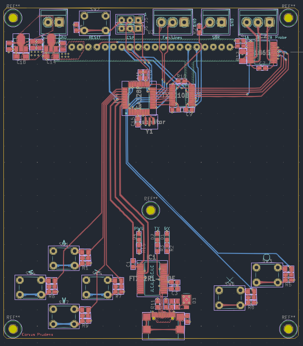

# Hardware

 This board combines several convenient features together to make an easy to use and highly capable reflow (toaster) oven controller. At the heart of the design is an ATMEGA328-P, with a few support features similar to what you might find on an Arduino board. This allows easy integration with the large Arduino ecosystem and convenient communication and flashing via USB (after flashing a bootloader via the ICSP header). To maximize performance, the 328-P is run at 5 volts -- supplied by either the USB Vbus or the included 7-12 volts LDO regulator. This allows the microcontroller to run at its highest rated frequency, 20 MHz, which is just enough to run all the UI screens at 30 frames per second.

 While the microcontroller can accept 5 volts, the two SPI connected modules -- the MAX31865 PTD probe sensor IC and the OLED display -- need 3.3 volts. Their power is supplied through another LDO, and the communication is routed through a very convenient level shifter, the TXB0108.

 The board itself is a 4 layer design. Of course, 4 layers is completely overkill for this design and would make no sense for a high-volume product. However, this is _not_ a high-volume product, and the manufacturer I use just so happened to drop their 4 layer prices insanely low. I'd be crazy not to make it 4!

 Finally, I'd like to highlight the use of USB-C. If I ever include USB functionality on a device, I will _always_ choose USB-C if I am able. Not only is it an aesthetically pleasing, reversible, fast, and powerful connection -- it's _dead easy_ to design with assuming you don't need its fancier features like power delivery or USB 3.0 (or the dreadfully named USB 3.1 gen 2!). All that's needed for a basic implementation is two resistors and a convenient USB 2.0 rated connector like the one I've used on this board. Give it a try!
